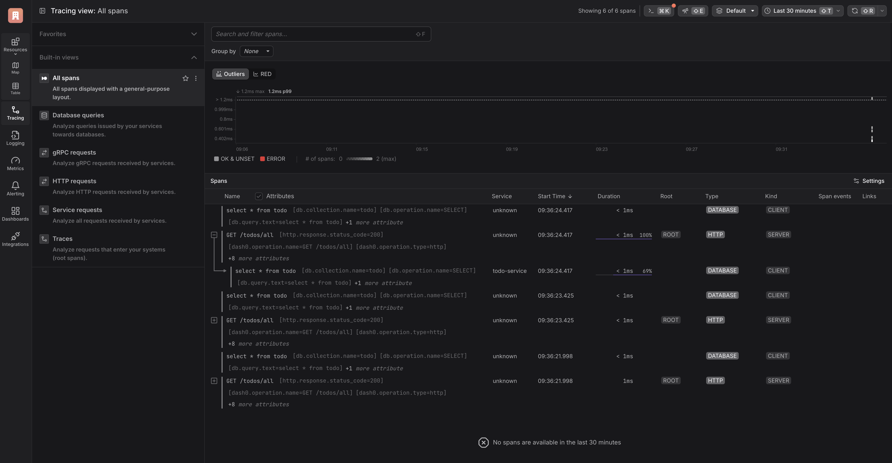
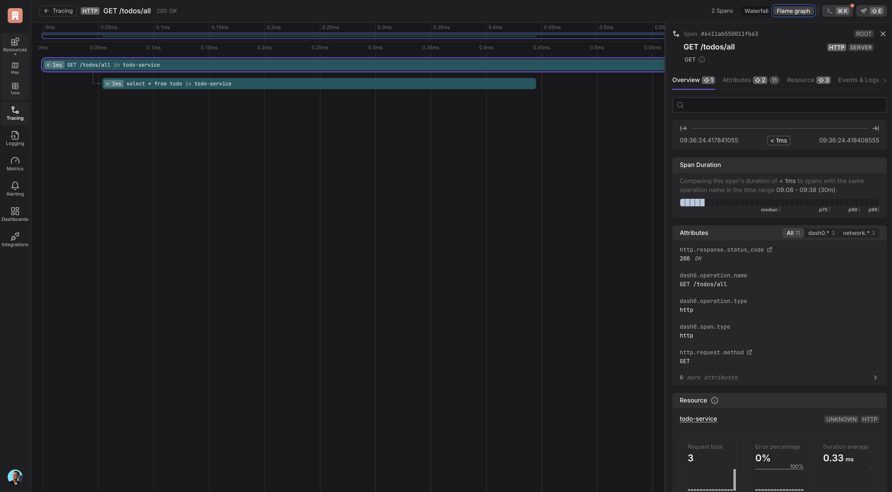

# Exploring OpenTelemetry Go Auto-Instrumentation with eBPF: A Deep Dive

This repository contains a simple demo application used for experimenting with the [OpenTelemetry Go Auto-instrumentation](https://github.com/open-telemetry/opentelemetry-go-instrumentation/tree/main) project.


## Getting Started with Go Auto-Instrumentation

I tested the project to explore its capabilities and provide guidance for those considering its use. Since the project is still in *beta* and marked as *work in progress*, **caution is advised before using it in production**.

To demonstrate its setup, I’ve prepared a simple todo application that uses PostgreSQL as storage. We’ll deploy this application in a local Kubernetes cluster using `kind` and configure OpenTelemetry auto-instrumentation.

### Setting up the environment

1. Create a Kind cluster

```sh
kind create cluster --name=go-otel-ebpf
```

2. Deploy PostgreSQL using helm. (this configures a database with the name todo, and sets password to be password) 

```sh
helm install pg oci://registry-1.docker.io/bitnamicharts/postgresql \
  --set global.postgresql.auth.postgresPassword=password \
  --set global.postgresql.auth.database=todo
```

3. Next, build and load the application into the cluster.

```sh
docker build -t todo:v0.1 .
kind load docker-image --name go-otel-ebpf todo:v0.1
```

Now we can run the application in Kubernetes. But before we do that, let’s have a look at how to enable auto-instrumentation in a Kubernetes environment. 
```yaml
apiVersion: apps/v1
kind: Deployment
metadata:
  name: todo
  ...
spec:
  ...
  template:
    ...
    spec:
      # 1. Share the Pods Process Namespace
      shareProcessNamespace: true 
      containers:
      - image: todo:v0.1
      ...
      # 2. Add the autoinstrumentation-go sidecar
      - name: autoinstrumentation-go
        image: otel/autoinstrumentation-go
        imagePullPolicy: IfNotPresent
        # 3. Configure the environment varialbes
        env:
          - name: OTEL_GO_AUTO_TARGET_EXE
            value: <location of the target binary>
          - name: OTEL_EXPORTER_OTLP_ENDPOINT
            value: "https://<endpoint>"
          - name: OTEL_SERVICE_NAME
            value: "<name of the service>"
        # 4. Ensure that the Container runs with elevated privileges
        securityContext:
          runAsUser: 0
          privileged: true
```

Before running the application, we need to configure where the telemetry data will be sent. In this example, I’ll be using [Dash0](https://www.dash0.com/), which you can sign up for [here](https://www.dash0.com/sign-up). Alternatively, you can use the OpenTelemetry Collector or other observability tools to view traces.

Once your account is set up, retrieve your token and add the following environment variables to the configuration of the otel/autoinstrumentation-go sidecar.
Edit this in the `manifests/deploy.yaml`.
```yaml
- name: autoinstrumentation-go
    env:
        - name: OTEL_LOG_LEVEL
        value: debug
        - name: OTEL_GO_AUTO_TARGET_EXE
        value: /todo
        - name: OTEL_EXPORTER_OTLP_ENDPOINT
        value: "https://<ENDPOINT>:4317"
        - name: OTEL_EXPORTER_OTLP_HEADERS
        value: "Authorization=Bearer <TOKEN>"
        - name: OTEL_EXPORTER_OTLP_PROTOCOL
        value: "grpc"
        - name: OTEL_SERVICE_NAME
        value: "todo-service"
        - name: OTEL_GO_AUTO_INCLUDE_DB_STATEMENT
        value: 'true'
        - name: OTEL_GO_AUTO_PARSE_DB_STATEMENT
        value: 'true'
```
You can omit OTEL_LOG_LEVEL unless you need to enable debug logging to troubleshoot issues.

The last two environment variables, OTEL_GO_AUTO_INCLUDE_DB_STATEMENT and OTEL_GO_AUTO_PARSE_DB_STATEMENT, instruct the sidecar to include and parse database statements. Since this example uses a database, enabling these ensures that database queries are captured correctly.

Now, let's deploy our application:
```sh
kubectl apply -f manifests/
```

Next, we’ll port-forward the service to test the endpoint locally and check if spans are being produced:

```sh
kubectl port-forward svc/todo 3000:3000
```
In another terminal, interact with the API:

```sh
# Create a new todo
curl -X POST localhost:3000/todos -H 'Content-Type: application/json' -d '{"Name": "Buy Coffee!"}'
curl -X POST localhost:3000/todos -H 'Content-Type: application/json' -d '{"Name": "Buy Beer!"}'

# List all todos
curl localhost:3000/todos/all
```

Finally, go to dash0.com, click on the Tracing menu item, and you should see something similar to the following:


Further deep dive into a specific trace, if you like, as shown below.


Our simple todo service is now automatically instrumented, and spans are correctly linked within a trace. 

As demonstrated, getting started with OpenTelemetry auto-instrumentation in a Go service requires minimal effort. 
However, this convenience comes with certain trade-offs, particularly around security and control.